# 顧客管理システム（CRM / Laravel オリジナルアプリ）

## 1. アプリ概要

本アプリケーションは、中小企業の業務システムを想定した **顧客管理（CRM）アプリ** です。
顧客・案件・対応履歴を一元管理でき、検索・絞り込み・ソート・権限管理・CSV 出力など、業務システムで求められる基本機能を備えています。

想定ユーザーは、顧客対応を行う担当者や管理者で、社内で顧客情報や案件進捗、対応履歴を共有し、必要な情報にすぐアクセスできる環境を提供できます。

Laravel を用いて **実務の開発プロセスに沿って 0 から構築したポートフォリオ作品** であり、業務系アプリ開発に必要な設計・実装・テストの流れを一通り経験できる構成としました。

---

## 2. 目的

- 業務系アプリで一般的に求められる CRUD・検索・権限管理・テストなどの基本機能を、設計から実装まで一貫して学習するため
- 顧客・案件・対応履歴のような階層構造を持つデータモデルを扱い、実務に近い設計・実装の流れを経験するため
- Laravel を用いた業務システム開発のプロセス（要件整理 → 設計 → 実装 → テスト）を再現し、基礎的な開発スキルを身につけるため
- 社内で情報共有を行う CRM を題材に、担当者が必要な情報にすぐアクセスできる”使いやすい業務アプリ”の構築を練習するため
- データの整合性・権限管理・検索性能など、業務システムで重視されるポイントを意識しながら開発を進めるため

---

## 3. 画像キャプチャ

本アプリケーションの主要画面（顧客・案件・対応履歴の一覧／詳細／登録／編集）を中心に、業務システムとしての操作性や UI の統一感が分かるように画面構成を紹介します。

特に以下のポイントが確認できます。

- 顧客 → 案件 → 対応履歴の階層構造に沿った画面遷移
- 検索・ソート・ページネーションを前提とした一覧画面の UX
- 詳細画面での関連情報の集約表示（案件一覧・対応履歴一覧）
- 入力フォームの統一された UI（Blade コンポーネント化）
- 実務を意識したボタン配置・操作導線

画面キャプチャは、アプリ全体の操作イメージを短時間で把握できるよう、一覧 → 詳細 → 登録 → 編集 の順に掲載しています。

### 3-1. ログイン画面

アプリ利用時に最初に表示される画面です。
メールアドレスとパスワードによる認証を行います。
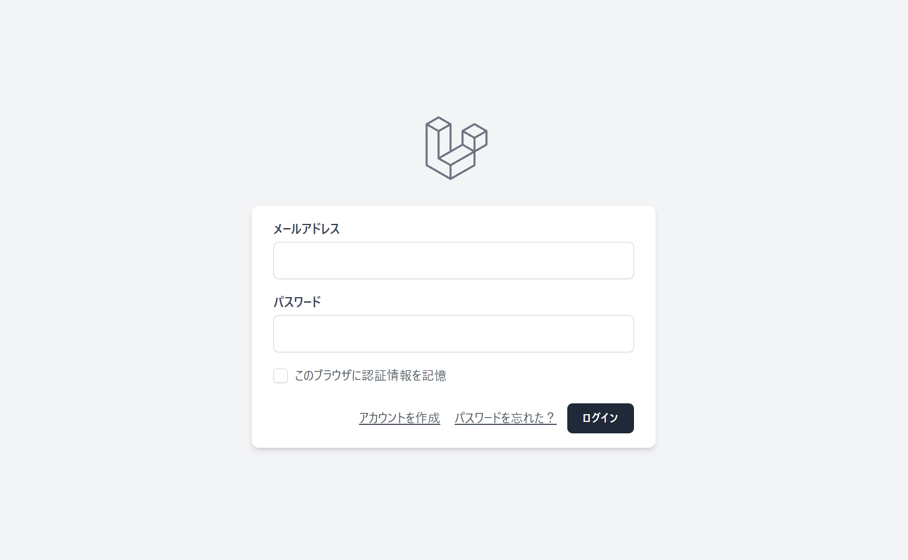

### 3-2. 顧客一覧（ナビゲーション）

ログイン後に遷移するトップ画面です。
顧客・案件・対応履歴の各画面へ移動できるナビゲーションを配置しています。
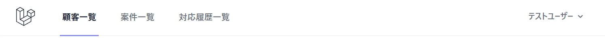

### 3-3. 顧客一覧（検索フォーム）

顧客名・メール・電話番号・会社名・ステータス・担当者・作成日など、複数条件での検索が可能です。
また、CSVエクスポートボタンから、一覧データをCSV形式でダウンロードできます。
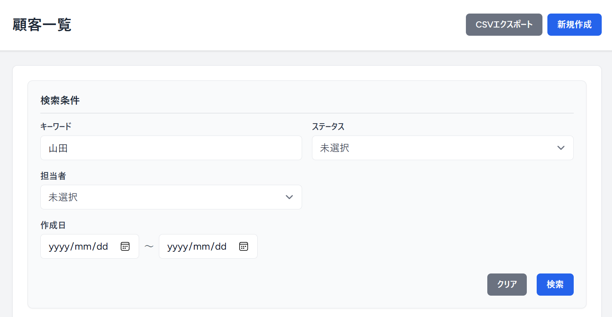

### 3-4. 顧客一覧（一覧テーブル）

検索結果を一覧表示し、顧客名・ステータス・担当者などの主要情報を確認できます。
顧客名・メール・会社名・作成日の各列はソートに対応しており、昇順・降順の切り替えが可能です。
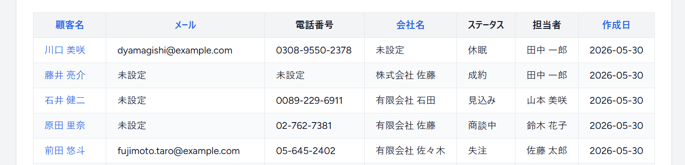

### 3-5. 顧客一覧（ページネーション）

20件ごとにページ分割し、前後ページへの移動が可能です。
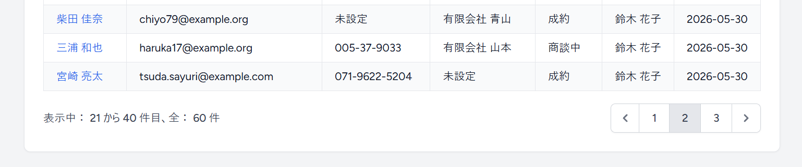

### 3-6. 顧客作成（基本情報）

顧客名・フリガナ・メールなどの基本情報を入力します。
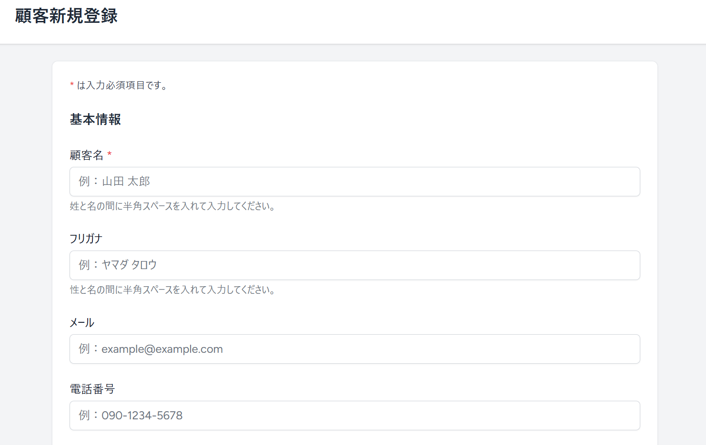

### 3-7. 顧客作成（住所情報）

郵便番号・住所・住所詳細などの住所情報を入力します。
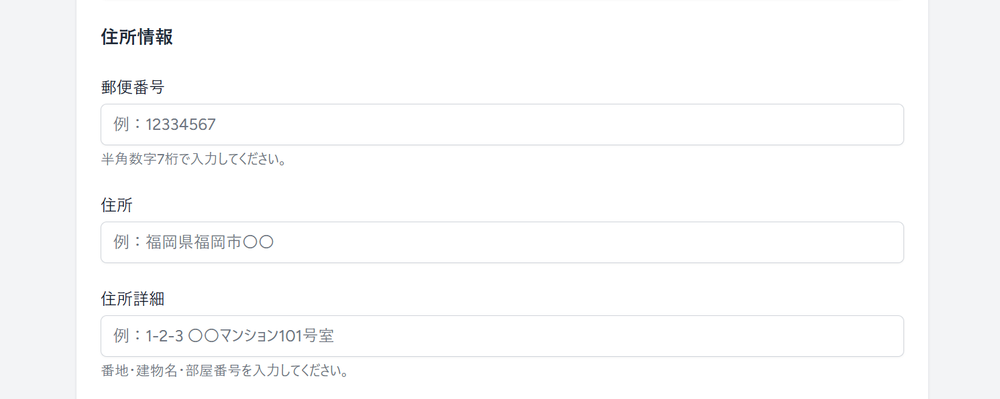

### 3-8. 顧客作成（会社・管理情報）

会社名・部署名・役職・ステータス・ランクなどの会社・管理情報を入力します。
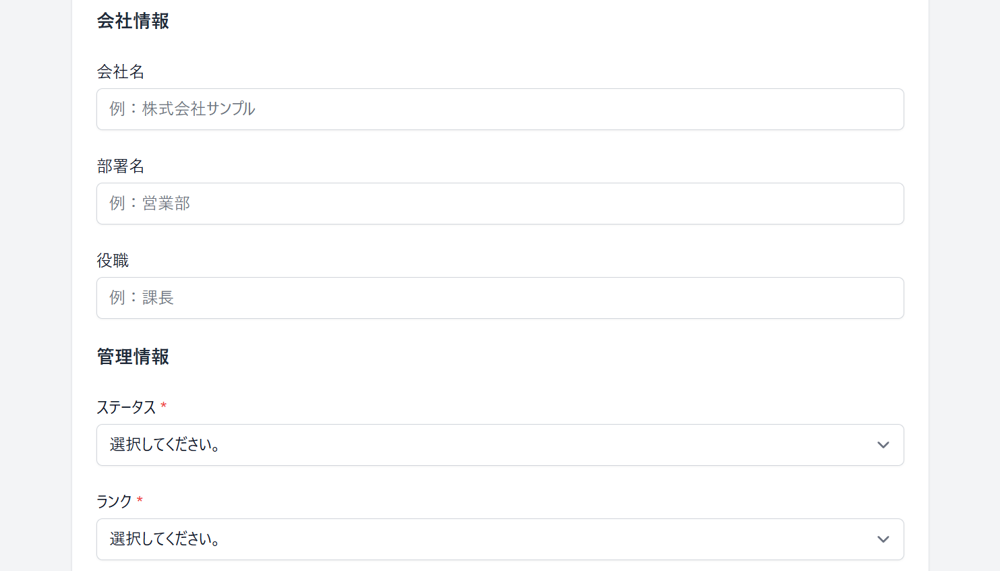

### 3-9. 顧客作成（登録ボタン）

入力内容を保存し、顧客を新規登録します。
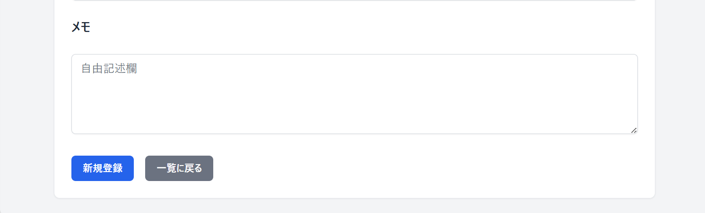

### 3-10. 顧客詳細（基本情報➀）

顧客名・連絡先・会社情報などの基本情報を確認できます。
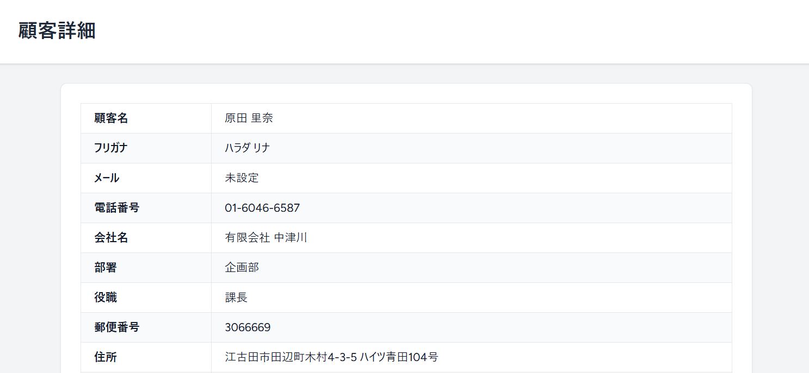

### 3-11. 顧客詳細（基本情報➁）

ステータス・ランク・担当者などの管理情報を確認できます。
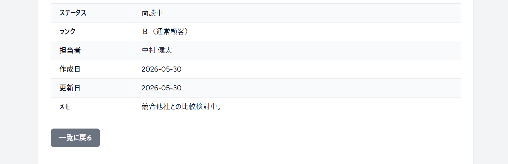

### 3-12. 顧客詳細（案件一覧・対応履歴一覧）

顧客に紐づく案件情報と対応履歴を一覧で確認できます。
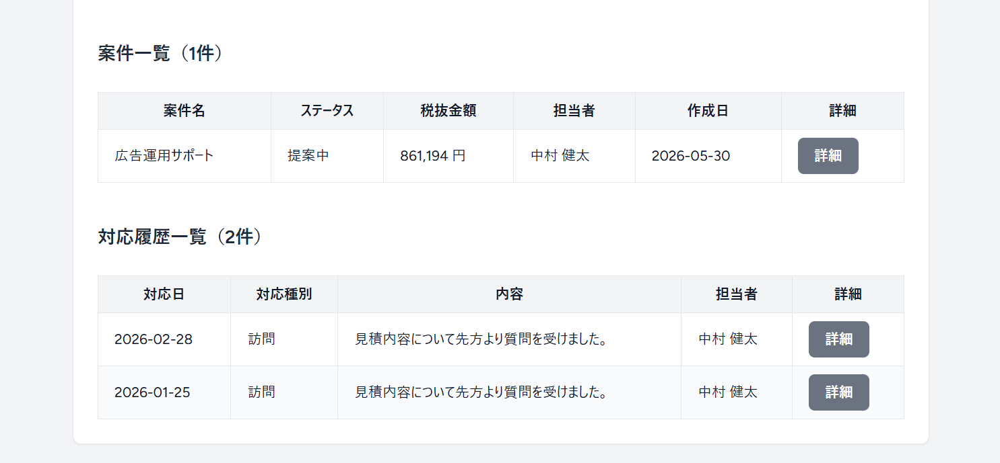

### 3-13. 案件一覧（検索フォーム）

案件名・顧客名・ステータス・担当者・税抜金額・期間・作成日など、複数条件での検索が可能です。
また、CSVエクスポートボタンから、一覧データをCSV形式でダウンロードできます。
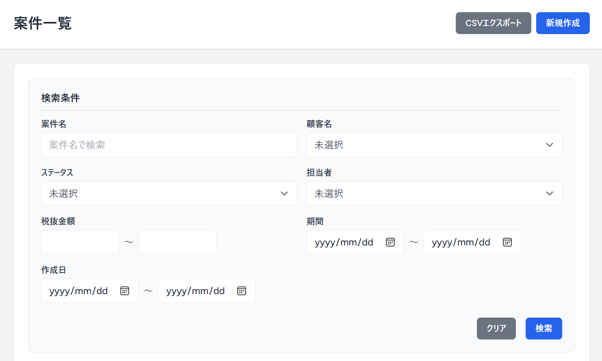

### 3-14. 案件一覧（一覧テーブル）

検索結果を一覧表示し、案件名・顧客名・担当者などの主要情報を確認できます。
案件名・顧客名・税抜金額・作成日の各列はソートに対応しており、昇順・降順の切り替えが可能です。
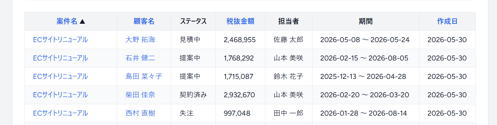

### 3-15. 案件一覧（ページネーション）

複数ページに分割して表示でき、前後ページへの移動が可能です。
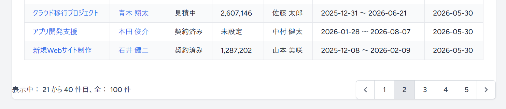

### 3-16. 対応履歴一覧（検索フォーム）

対応日時・対応種別・内容・案件名・顧客名・担当者など、複数条件での検索が可能です。
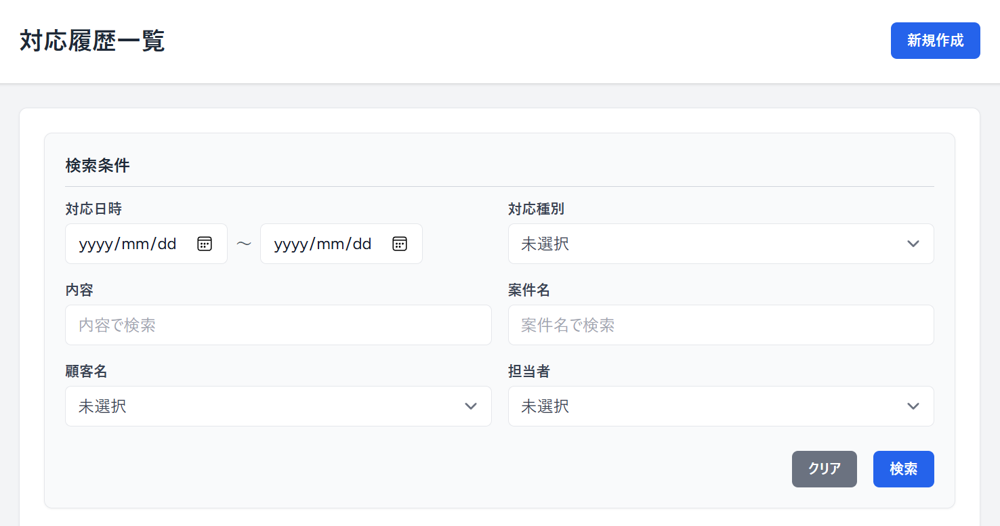

### 3-17. 対応履歴一覧（一覧テーブル）

検索結果を一覧表示し、対応日時・案件名・顧客名・担当者などの主要情報を確認できます。
対応日時・顧客名の各列はソートに対応しており、昇順・降順の切り替えが可能です。
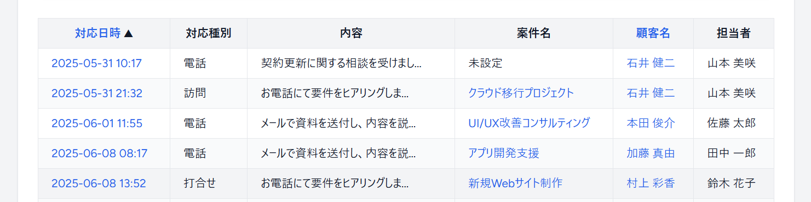

### 3-18. 対応履歴一覧（ページネーション）

複数ページに分割して表示でき、前後ページへの移動が可能です。
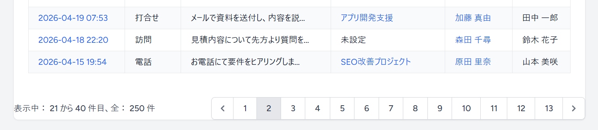

### 3-19. テスト実行結果（Pest）

Pest を用いた Feature / Unit テストはすべて PASS しており、アプリ全体の動作が自動テストで保証されています。
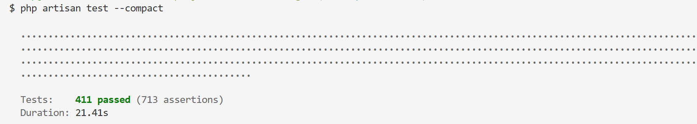

---

## 4. 主な機能一覧

- 顧客・案件・対応履歴の管理（CRUD）
- 認証機能（Breeze）
- 複数条件検索・ソート・ページネーション維持
- master 管理（顧客ステータス / ランク / 案件ステータス / 対応種別）
- 顧客詳細ページで案件・対応履歴を関連表示
- 担当者制（assigned_user_id による責任範囲の明確化）
- 担当者の自動設定（作成時にログインユーザーを自動割り当て）
- 権限管理（閲覧・作成は全ユーザー、編集・削除は担当者のみ）
- 外部キー制約（restrict / nullOnDelete によるデータ保護）
- CSV エクスポート（顧客一覧・案件一覧、検索条件を反映）
- SoftDeletes（論理削除）
- Feature Test（CRUD・検索・ソート・リレーション）
- Unit Test（FormRequest / Policy）
- Factory / Seeder によるダミーデータ生成

---

## 5. 使用技術

### バックエンド

- Laravel 12.46
- PHP 8.4
- Laravel Breeze（認証）
- Eloquent ORM

### フロントエンド

- Blade
- Tailwind CSS 3.1

### テスト

- Pest
- Feature Test / Unit Test
- Factory / Seeder

---

## 6. セットアップ手順

```sh
git clone https://github.com/Kouhei-Yagi/laravel-crm-app.git
cd customer-manager

composer install
npm install

cp .env.example .env
php artisan key:generate

touch database/database.sqlite

php artisan migrate --seed

npm run dev
```

- ログインユーザーは UserSeeder にて作成しています。
- Tailwind CSS は Vite によりビルドされるため、npm run dev を実行する必要があります。
- 開発環境は SQLite を使用しています。

---

## 7. ER 図

本アプリケーションの ER 図は以下の通りです。
GitHub 上では Mermaid により自動描画されます。

また、ER 図は `docs/er-diagram.mmd` にて管理しており、
**マイグレーション変更時に随時更新しています。**

各テーブルには `assigned_user_id` を持たせ、
**担当者制（責任範囲の明確化）** を実現しています。

```mermaid
erDiagram

    customers ||--o{ projects : "has many"
    customers ||--o{ interactions : "has many"

    projects ||--o{ interactions : "has many"
    users ||--o{ projects : "assigned to"
    users ||--o{ interactions : "logs"

    customers {
        int id PK "UNIQUE - AUTO_INCREMENT"
        string name
        string kana "nullable"
        string email "nullable"
        string phone "nullable"
        string company_name "nullable"
        string department "nullable"
        string position "nullable"
        string postal_code "nullable, length:7"
        string address "nullable"
        string address_detail "nullable"
        enum status "prospect / negotiation / won / lost / inactive"
        enum rank "A / B / C"
        int assigned_user_id FK
        text memo "nullable"
        datetime created_at
        datetime updated_at
        datetime deleted_at "nullable"
    }

    projects {
        int id PK "UNIQUE - AUTO_INCREMENT"
        int customer_id FK
        string title
        text description "nullable"
        enum status "estimating / proposing / contracted / lost / on_hold"
        unsigned int amount "nullable"
        date start_date "nullable"
        date end_date "nullable"
        int assigned_user_id FK
        text memo "nullable"
        datetime created_at
        datetime updated_at
        datetime deleted_at "nullable"
    }

    interactions {
        int id PK "UNIQUE - AUTO_INCREMENT"
        int customer_id FK
        int project_id FK "nullable, nullOnDelete"
        int assigned_user_id FK
        enum type "phone / email / visit / meeting"
        text content
        datetime interacted_at
        text memo "nullable"
        datetime created_at
        datetime updated_at
        datetime deleted_at "nullable"
    }

    users {
        int id PK "UNIQUE - AUTO_INCREMENT"
        string name
        string email "UNIQUE"
        datetime email_verified_at "nullable"
        string password
        string remember_token
        datetime created_at
        datetime updated_at
    }
```

---

## 8. 設計思想

本アプリケーションは、実務の CRM（顧客管理）に近い運用を想定し、「責任の所在が明確で、情報が共有され、データ品質が保たれる」ことを最重要方針として設計しています。

### 顧客 → 案件 → 対応履歴 の階層構造

- 実務で一般的な階層構造を採用し、顧客から案件・対応履歴まで一貫して追跡可能な設計
- 顧客詳細ページで関連情報をまとめて確認できる UI / DB 設計

### 担当者制（assigned_user_id）による責任範囲の明確化

- 顧客・案件・対応履歴すべてに担当者を必須化し、責任の所在を明確化
- 作成時にログインユーザーを自動割り当てし、運用負荷を軽減
- Policy による「担当者のみ編集・削除可能」という実務的な権限制御を実現

### データ品質と安全性の確保

- 外部キー制約（restrict / nullOnDelete）により誤削除を防止
- enum によるステータス・ランク・種別の厳格管理で不正値を排除
- SoftDeletes により復元可能なデータ運用を実現

### 一覧画面の操作性を重視した設計

- 検索・ソート・ページネーションを前提としたクエリ構造
- 実務で最も利用頻度の高い「一覧画面」の UX を最優先で設計

### テスト容易性を考慮した設計

- リレーション・バリデーション・権限を明確化し、Feature / Unit Test を実装しやすい構造を採用

---

## 9. 技術的な工夫

### 検索ロジックの共通化

- 顧客・案件・対応履歴の検索処理をモデルに集約し、再利用性と保守性を向上

### ソート処理の共通化

- クエリパラメータに応じて任意のカラムをソートできる仕組みを実装し、一覧画面の操作性を統一

### 日付範囲の自動補正（前後入れ替え対応）

- 「終了日 < 開始日」の場合に自動補正し、ユーザーの入力ミスを吸収

### Blade コンポーネント化による UI の再利用性向上

- ボタン・フォーム・検索 UI・テーブルヘッダーなどをコンポーネント化し、UI の一貫性と保守性を向上

### FormRequest によるバリデーション

- 入力チェックをコントローラから分離し、責務を明確化

### Policy による権限管理

- 担当者以外の編集・削除を禁止し、実務的な担当者制を実現

### JOIN を用いた関連データ取得

- 顧客詳細ページで案件・対応履歴を効率的に取得するための最適なクエリを設計

### Seeder / Factory の整合性

- 日本語の実務データを生成し、UI 確認とテストの再現性を向上

### Pest による Feature Test / Unit Test

- CRUD・検索・ソート・リレーションを Feature Test で保証
- FormRequest・Policy を Unit Test で個別検証

---

## 10. このアプリケーションで学んだこと

本アプリケーションの開発を通じて、業務システム開発における以下のポイントを理解しました。

### 一覧画面の操作性が業務効率に大きく影響すること

- 検索・ソート・ページネーションなど、一覧画面の設計が業務アプリでは特に重視される

### 責務分離と設計の明確化が保守性を高めること

- Controller に集まりがちな処理を FormRequest・Policy に分けることで、役割が明確になり、保守しやすい構造になる

- 事前に設計を丁寧に行うことで、実装時に迷わず一貫性を保てる

### テストコードが改善の安心感につながること

- Feature / Unit Test を整備することで、仕様を確認しながら安全に改善できる

### 「データ品質」と「権限管理」が重要であること

- enum 管理・外部キー制約・担当者制など、データの正確性と安全性を保つ仕組みが重視される
- SoftDelete によりデータを残す設計が、実務的な運用において有効である

### UI コンポーネント化が保守性と一貫性を高めること

- ボタン・フォーム・検索 UI などをコンポーネント化することで、画面間の統一性が保たれ、コードの見通しが良くなることを理解しました。

---

## 11. 開発プロセス

本アプリケーションは、実務を意識しながら「段階的に機能を拡張し、品質を高めていく」プロセスで開発しました。

### 1. 要件整理・データ設計

- 要件を整理し、顧客 → 案件 → 対応履歴の階層構造を定義
- ER 図・テーブル設計を先に固め、後工程のブレを防止

### 2. 基盤構築（認証・日本語化・マイグレーション）

- Breeze による認証機能を導入し、最低限のログイン環境を整備
- 日本語化やマイグレーション作成で開発基盤を準備

### 3. CRUD の実装（顧客 → 案件 → 対応履歴）

- まずは CRUD を実装し、アプリとして動く最小単位を完成
- ドメインごとに CRUD を順番に実装し、機能の土台を構築

### 4. 検索・ソート機能の実装と共通化

- 一覧画面の操作性向上のため、検索・絞り込み・ソートを追加
- 検索ロジック・ソート処理・日付範囲補正を共通化し、コードの重複を排除して保守性を向上

### 5. バリデーション・権限管理の導入

- FormRequest によるバリデーションで責務分離を実現
- Policy による権限管理で「担当者のみ編集・削除可能」という実務的な制御を実装

### 6. UI/UX の改善

- Blade コンポーネント化（ボタン・フォーム・検索 UI・テーブルヘッダーなど）により、UI の一貫性と再利用性を向上
- 顧客詳細ページに案件一覧・対応履歴一覧を追加し、情報の追跡性を強化

### 7. CSV エクスポートの実装

- 検索条件を反映した CSV 出力を実装し、実務で使える形に拡張

### 8. テストの追加（Feature / Unit）

- CRUD・検索・ソート・リレーションを Feature Test で検証
- FormRequest・Policy を Unit Test で検証し、仕様の保証とリファクタリング耐性を確保

### 9. ダミーデータ・命名規則の整備

- 日本語の実務的なダミーデータを Seeder / Factory で生成
- コード全体の命名規則を統一し、可読性を向上

### 10. README の整備

- プロジェクトの内容を整理し、概要や開発意図が伝わるように文書化

---

## 12. 使用環境

### 開発環境

- Windows 11
- Herd（PHP 実行環境）
- SQLite（ローカル開発用）
- Git / GitHub

### 言語・フレームワーク

- PHP 8.4
- Laravel 12.46
- Composer 2.9

### フロントエンド

- Node.js 24.9.0 / npm 11.6.0
- Tailwind CSS（Breeze により導入）

### テスト

- Pest（Feature / Unit Test）

---

## 13. ディレクトリ構成

```
customer-manager/
├── app/
│   ├── Http/
│   │   ├── Controllers/            # 顧客・案件・対応履歴のコントローラ
│   │   └── Requests/               # バリデーション（FormRequest）
│   ├── Models/                     # 顧客・案件・対応履歴モデル
│   ├── Policies/                   # 権限管理（Policy）
│   └── Traits/                     # ソート処理（SortTrait）
│
├── database/
│   ├── factories/                  # Factory（顧客・案件・対応履歴）
│   ├── migrations/                 # マイグレーション
│   └── seeders/                    # 日本語ダミーデータ生成
│
├── docs/                           # 設計資料
│   ├── images/                     # README 用キャプチャ
│   ├── design_notes.md             # 設計メモ
│   ├── dev_notes.md                # 開発メモ
│   ├── er-diagram.mmd              # ER 図
│   ├── master_values.md            # マスタ値の説明
│   ├── requirements.md             # 要件整理
│   └── table_definitions.ods       # テーブル定義書
│
├── resources/
│   └── views/                      # Blade テンプレート
│       ├── auth/                   # Breeze 認証画面
│       ├── customers/              # 顧客画面
│       ├── projects/               # 案件画面
│       ├── interactions/           # 対応履歴画面
│       ├── layouts/                # レイアウト（app.blade.php など）
│       ├── profile/                # Breeze プロフィール画面
│       └── components/             # Blade コンポーネント
│           ├── button/             # primary / secondary / danger ボタン
│           ├── customer/           # 顧客詳細ページ用（案件一覧・対応履歴一覧）
│           ├── search/             # 検索フォーム一式
│           ├── table/              # テーブル関連
│           ├── alert.blade.php     # フラッシュメッセージ
│           ├── field.blade.php     # 入力フォームの field ラッパー
│           ├── input.blade.php     # input コンポーネント
│           ├── select.blade.php    # select コンポーネント
│           └── textarea.blade.php  # textarea コンポーネント
│
├── routes/
│   └── web.php                     # ルーティング定義
│
└── tests/
    ├── Feature/                    # CRUD・検索・ソート・リレーションの Feature Test
    └── Unit/                       # FormRequest・Policy の Unit Test
```

---

## 14. Git 運用ルール（GitHub Flow）

本アプリケーションでは、軽量でシンプルな **GitHub Flow** を採用し、可能な限り「小さく作って小さくマージする」方針を基本としています。

### ブランチ運用ルール

#### ブランチ種別

- **main** : 常にデプロイ可能な安定版コード
- **feature/** : 新機能の開発
- **refactor/** : コード整理・責務分離・最適化
- **perf/** : パフォーマンス改善
- **bugfix/** : バグ修正
- **hotfix/** : 緊急修正（本番想定）
- **docs/** : ドキュメント修正
- **test/** : テストコードの追加・修正
- **chore/** : 依存更新・設定変更などの雑務

#### ブランチ命名例

```sh
feature/customer-crud
bugfix/fix-phone-validation
refactor/customer-service
docs/update-readme
```

### コミットメッセージ規約（Conventional Commits）

コミットメッセージは、**「プレフィックス（英語）＋ 内容（日本語）」**の形式で記述します。

#### プレフィックス一覧

- **feat** : 新機能の追加
- **fix** : バグ修正
- **refactor** : コードの整理・最適化
- **style** : コード整形（動作に影響なし）
- **remove** : 不要なコード・ファイルの削除
- **docs** : ドキュメントの更新
- **test** : テストの追加・修正
- **chore** : 環境設定・依存更新・CI/CD
- **perf** : パフォーマンス改善

#### コミットメッセージ例

```sh
feat: 顧客作成フォームを追加
fix: 電話番号バリデーションの不具合を修正
refactor: 顧客コントローラの処理を整理
docs: README にセットアップ手順を追記
test: 顧客検索のFeatureテストを追加
chore: Laravel Breeze をインストール
remove: 未使用のコンポーネントを削除
```

### 開発フロー

1. `main` から作業ブランチを作成
2. 作業ブランチで開発・コミット
3. GitHub にプッシュ
4. Pull Request を作成
5. セルフレビュー
6. 問題なければ `main` にマージ

※ `main` へ直接コミットは行いません。

### Pull Request の方針

- 1 PR は 1 つの目的に限定（小さくまとめる）
- 変更内容・意図などを記載
- 自分でコードを読み直す「セルフレビュー」を実施

---

## 15. 今後の改善予定

本アプリケーションは、業務システムとしての使いやすさ・保守性・拡張性をさらに高めるため、以下の改善を予定しています。

#### 機能拡張

- ダッシュボードの追加
    - 案件数・売上見込み・対応件数などを可視化し、業務状況を俯瞰できる画面を追加
- ファイル添付機能の導入
    - 顧客・案件に関連資料（PDF 等）をアップロード・管理できるように拡張
- タグ管理の追加
    - 顧客をタグ分類し、柔軟な検索・絞り込みを可能にする
- アクティビティログの記録
    - 「誰が・いつ・何を変更したか」を記録し、変更履歴を追跡できるようにする

#### UX / UI 改善

- 詳細ページの 2 カラムレイアウト化
    - 基本情報と関連情報（案件・対応履歴）を横並びにし、視認性を向上
- 顧客詳細ページのカード化
    - 情報ブロックをカード UI に統一し、読みやすさと一貫性を向上
- 検索条件の折りたたみ（開閉）機能
    - 検索フォームを折りたたみ可能にし、一覧画面の操作性を改善
- レスポンシブ最適化の強化
    - スマートフォン・タブレットでの閲覧性を向上
- 顧客詳細から対応履歴を直接追加できる導線の改善
    - 顧客詳細ページからワンクリックで対応履歴を登録できるようにする

### 技術的改善

- サービス層の導入による Controller の責務分離
    - ビジネスロジックを Service クラスへ移動し、Controller の可読性と保守性を向上
- 検索・ソートロジックの共通化の強化
    - SearchFilter / Sortable Trait を拡張し、一覧画面のロジックをより再利用可能にする
- CSV エクスポート処理の Service 化
    - CSV 出力処理を専用クラスに切り出し、責務分離とテスト容易性を向上

### テスト強化

- CSV エクスポート機能の Feature Test 追加
    - 検索条件を反映した CSV 出力の動作保証を自動化し、品質を向上

---
