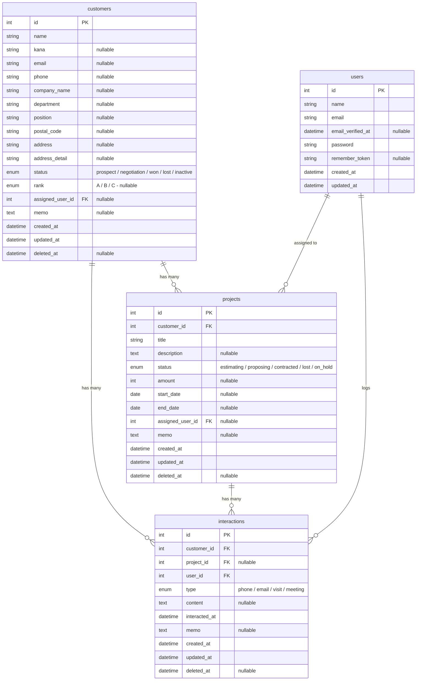

# 顧客管理システム（CRM / Laravel オリジナルアプリ）

このアプリは、中小企業向けの業務システム開発を想定した、シンプルで拡張性の高い顧客管理（CRM）アプリです。
Laravel Breeze を用いた認証機能をベースに、顧客情報・案件情報・対応履歴を一元管理できる仕組みを構築します。
実務でよく使われる CRM の最小構成を再現し、業務システム開発の理解を深めることを目的として作成しています。

---

## 🎯 目的

- Laravel を用いた業務システム開発の実践力向上
- 中小企業向けの受託開発で求められる CRM の基本機能を理解・再現
- CRUD・検索・JOIN・認証・権限・テストなど、実務で必須の技術を体系的に習得
- ポートフォリオとして「業務システムを作れる」ことを示す

---

## 🖥 使用環境

- Windows 11
- Herd（PHP 実行環境）
- PHP 8.4
- Laravel 12.46
- Composer 2.9
- Node.js / npm
- SQLite（開発環境）
- Git / GitHub

---

## 🧱 使用技術

### バックエンド

- Laravel 12.46
- PHP 8.4
- Laravel Breeze（Blade + Tailwind）
- Eloquent ORM
- SQLite（開発環境）

### フロントエンド

- Blade
- Tailwind CSS
- Alpine.js（必要に応じて）

### テスト

- Pest（Feature Test）
- Laravel のテストヘルパー
- Factory / Seeder

---

## 🚀 セットアップ方法（開発初期）

```sh
# リポジトリのクローン
git clone https://github.com/Kouhei-Yagi/customer-manager.git
cd customer-manager

# 依存関係のインストール
composer install
npm install

# 環境ファイルの作成
cp .env.example .env

# アプリキーの生成（すでに生成済みの場合は不要）
php artisan key:generate

# SQLite データベース作成（ファイルが存在しない場合のみ）
touch database/database.sqlite

# Breeze導入後、マイグレーションを実行
php artisan migrate

# .env の主な設定（日本語化後）
APP_NAME="Customer Manager"
APP_URL=http://customer-manager.test
DB_CONNECTION=sqlite
DB_DATABASE=./database/database.sqlite
APP_LOCALE=ja
APP_FAKER_LOCALE=ja_JP
※ 本プロジェクトは日本語ロケール（ja）および JST（Asia/Tokyo）に設定済みです。
```

---

## ER 図

ER 図は`docs/er-diagram.mmd`にて管理しています。
最新のテーブル構造に合わせて随時更新しています。



---

## ディレクトリ構成（予定）

```
customer-manager/
├── app/
│ ├── Models/ # 顧客・案件・対応履歴モデル
│ ├── Http/
│ │ ├── Controllers/ # 顧客・案件・対応履歴のコントローラ
│ │ └── Requests/ # バリデーション（FormRequest）
├── database/
│ ├── migrations/ # マイグレーション（後で追加）
│ ├── seeders/ # テストデータ生成
│ └── factories/ # Factory
├── docs/
│ ├── requirements.md # 要件整理
│ ├── er-diagram.mmd # ER 図
│ ├── table_definitions.ods # テーブル定義書（Calc）
│ ├── master_values.md # master の説明
│ ├── design_notes.md # 設計メモ
│ └── dev_notes.md # 開発メモ
├── resources/
│ └── views/ # Blade テンプレート
└── tests/
  └── Feature/ # CRUD・検索・認可のテスト
```

---

## 📚 Git 運用ルール（GitHub Flow）

本プロジェクトでは、軽量でシンプルな **GitHub Flow** を採用し、ブランチ運用とコミットメッセージに一定のルールを設けています。

### 🔀 ブランチ運用ルール

#### ブランチ名

- **main** : 常にデプロイ可能な安定版コードを保持
- **feature/** ： 新機能の開発
- **refactor/** : コードの整理・最適化
- **perf/** : パフォーマンス改善
- **bugfix/** : バグ修正
- **hotfix/** : 本番環境の緊急対応
- **docs/** : ドキュメント変更
- **test/** : テストコードの追加・修正
- **chore/** : 環境設定・CI/CD・依存更新

#### ブランチ命名例

```sh
feature/customer-crud
bugfix/fix-phone-validation
refactor/customer-service
docs/update-readme
```

---

### 🔁 開発フロー

1. `main` から作業ブランチを作成
2. 作業ブランチで開発・コミット
3. GitHub にプッシュ
4. Pull Request を作成
5. レビュー後、`main` にマージ

※ `main` へ直接コミットは行いません。

---

### 📝 コミットメッセージ規約（Conventional Commits 準拠）

コミットメッセージは **プレフィックス（英語）＋ 内容（日本語）** の形式で記述します。

#### プレフィックス一覧

- **feat** : 新機能の追加
- **fix** : バグ修正
- **refactor** : コードの整理・最適化
- **style** : コード整形（動作に影響なし）
- **remove** : 不要なコード・ファイルの削除
- **docs** : ドキュメントの更新
- **test** : テストの追加・修正
- **chore** : 環境設定・依存更新・CI/CD
- **perf** : パフォーマンス改善

#### コミットメッセージ例

```sh
feat: 顧客作成フォームを追加
fix: 電話番号バリデーションの不具合を修正
refactor: 顧客コントローラの処理を整理
docs: README にセットアップ手順を追記
test: 顧客検索のFeatureテストを追加
chore: Laravel Breeze をインストール
remove: 未使用のコンポーネントを削除
```

---

## 📂 機能一覧

### 基本機能

- 認証（Laravel Breeze）
- 日本語化
- 顧客の CRUD
- 顧客に紐づく案件の CRUD
- 顧客に紐づく対応履歴の CRUD

### 顧客管理の強化

- 顧客検索（名前 / メール / 電話）
- 絞り込み（ステータス / 担当者）
- ソート（登録日 / 更新日 / 案件数）
- ページネーション維持
- 複合検索（顧客 + 案件 + 対応履歴）

### 関連データ

- 顧客詳細ページで案件一覧・対応履歴一覧を表示
- JOIN を用いた関連データの表示
- 案件数や最終対応日の集計

### 業務システム向け機能

- SoftDeletes（論理削除）
- 権限管理（Policy）
- CSV エクスポート（顧客一覧）
- 更新履歴（Activity Log）※任意

### UI / UX

- Tailwind による一覧テーブルの整形
- ステータスバッジ
- モーダルでの顧客追加（任意）
- エラーページのカスタマイズ

---

## 🧭 今後の開発フロー

1. プロジェクト作成（完了）
2. 要件整理・ER 図・テーブル設計（完了）
3. Breeze 導入（完了）
4. 日本語化（完了）
5. マイグレーションファイルの作成（完了）
6. 顧客 CRUD の実装
7. 案件 CRUD の実装
8. 対応履歴 CRUD の実装
9. 検索・絞り込み・ソートの実装
10. 権限管理（Policy）
11. CSV エクスポート
12. Feature Test の追加
13. UI/UX 改善
14. README の更新
